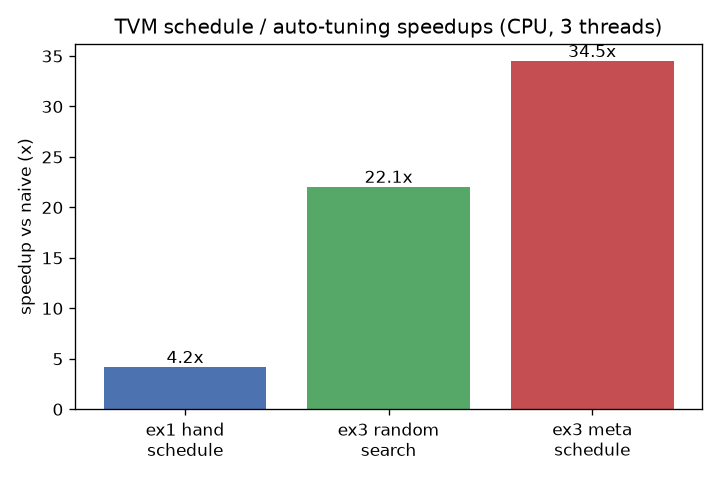
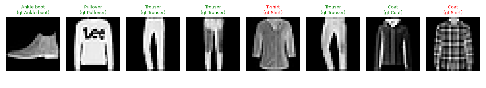

# MLC Exercises — Machine Learning Compilation with Apache TVM

> Solutions to the **Machine Learning Compilation** course exercises — TensorIR
> tensor programs, end-to-end model compilation in Relax, automatic program
> optimization (meta-schedule), and PyTorch framework integration — an
> independent, from-skeleton implementation of **MLC (mlc.ai, Tianqi Chen)**,
> part of a [csdiy.wiki](https://csdiy.wiki/) full-catalog build.


## Overview

[Machine Learning Compilation](https://mlc.ai/) teaches how to take a model from
a training framework (PyTorch/TensorFlow/JAX) and progressively lower, transform
and optimize it into fast deployable code, using **Apache TVM** (TensorIR +
Relax). This repo implements the course's core exercises from scratch and
**runs them for real on CPU**: every program is built, executed, and checked
against a NumPy/PyTorch reference, and every claimed speedup is measured with
TVM's own `time_evaluator`.

The official course exercises are notebooks
([`mlc-ai/notebooks`](https://github.com/mlc-ai/notebooks)); the official
`assignment1.ipynb` skeleton is kept as the base commit under `notebooks/`, and
each exercise is implemented as a clean, tested Python module under `src/`.

> **Note on the TVM version.** The course was written for the `mlc-ai-nightly`
> *TVM Unity* wheels (Linux/macOS only). This repo targets the public
> `apache-tvm` **0.25** wheel — the post-Unity-refactor build that installs
> natively on Windows CPU — whose API was renamed (`tvm.tir.Schedule` →
> `tvm.s_tir.Schedule`, `tvm.script.tir` → `tvm.script.tirx` with `s_tir=True`,
> `T.block` → `T.sblock`, `tvm.nd` → `tvm.runtime`, etc.). `src/mlc_compat.py`
> documents the full mapping. All four exercises run end-to-end on this build.

## Results (measured on CPU, 3 threads; apache-tvm 0.25, torch 2.12 CPU)

| Exercise | What it does | Result (measured) |
|---|---|---|
| **1 · TensorIR** | matmul+ReLU written in TVMScript, then a `split/reorder/fuse/parallel/unroll/vectorize` schedule | correct to **2.3e-5** vs NumPy; hand-schedule **4.2×** faster (3.28 → 0.78 ms) |
| **2 · End-to-end Relax** | Fashion-MNIST CNN built with `BlockBuilder`+`emit_te`; conv2d also via a registered external PyTorch kernel; conv2d TensorIR scheduled | outputs match PyTorch to **1.2e-7**; compiled Relax model reaches **84.5%** real Fashion-MNIST test accuracy (2000 imgs) |
| **3 · Auto-optimization** | matmul (512²) tuned by an in-process random search and by real `meta_schedule.tune_tir` | random search **22.1×**, meta-schedule **34.5×** speedup (169 → 4.9 ms), numerically verified |
| **4 · PyTorch integration** | trace `nn.Module` with `torch.fx`, import via `from_fx`, run a Relax optimization pipeline, compile & run | imported CNN matches PyTorch to **1.5e-8** |



Sample predictions from the **compiled Relax model** on the real Fashion-MNIST
test set (green = correct):



Full numbers in [`results/summary.json`](results/summary.json); full log in
[`results/run_all.log`](results/run_all.log).

## Implemented exercises

- [x] **Ex 1 — TensorIR tensor-program abstraction & transformations**
  (`src/ex1_tensorir.py`): TVMScript & Tensor-Expression matmul+ReLU, a full loop
  schedule, and a batched-matmul + bias + ReLU case study.
- [x] **Ex 2 — End-to-end model execution in Relax** (`src/ex2_end_to_end.py`,
  MLC *assignment 1* §2–4): build the Fashion-MNIST classifier via
  `emit_te`/TOPI, integrate an external PyTorch conv2d kernel, and schedule the
  conv2d TensorIR.
- [x] **Ex 3 — Automatic program optimization** (`src/ex3_auto_optimize.py`):
  stochastic schedule search with `sample_perfect_tile`, and real
  `meta_schedule.tune_tir` evolutionary tuning.
- [x] **Ex 4 — Integration with ML frameworks** (`src/ex4_pytorch_integration.py`):
  `torch.fx` → `relax.frontend.torch.from_fx` → Relax optimization pipeline → VM.

## Project structure

```
mlc-exercises/
├── src/
│   ├── mlc_compat.py            # course-era API  ->  apache-tvm 0.25 helpers
│   ├── ex1_tensorir.py          # TensorIR programs & schedules
│   ├── ex2_end_to_end.py        # Relax end-to-end Fashion-MNIST model
│   ├── ex3_auto_optimize.py     # random search + meta-schedule tuning
│   └── ex4_pytorch_integration.py
├── tests/                       # pytest numerical-correctness suite (16 tests)
├── scripts/
│   ├── get_data.py              # download assignment weights + Fashion-MNIST
│   └── run_all.py               # reproduce every result -> results/
├── results/                     # measured evidence (json, log, figures)
├── notebooks/assignment1_official.ipynb   # official skeleton (base commit)
└── requirements.txt
```

## How to run

```bash
# Python 3.11 with the shared csdiy env, or any venv:
#   D:\Project\_csdiy\.venv-ml\Scripts\python.exe
python -m pip install -r requirements.txt

# 1. download the assignment's own weights + Fashion-MNIST (git-ignored)
python scripts/get_data.py

# 2. run the full test suite (numerical correctness of every exercise)
OMP_NUM_THREADS=3 python -m pytest -m "not slow"      # 15 fast tests
OMP_NUM_THREADS=3 python -m pytest -m slow            # + meta-schedule tuning

# 3. reproduce every measured number + figures into results/
OMP_NUM_THREADS=3 python scripts/run_all.py
```

## Verification

- **Correctness:** `pytest` — 16 tests (15 fast + 1 meta-schedule). Every
  TensorIR / Relax program is executed and `np.testing.assert_allclose`-checked
  against a NumPy or PyTorch reference (see `tests/`).
- **Schedules preserve semantics:** transformed modules are rebuilt and compared
  to the originals; the tests also assert the intended primitives
  (`T.parallel`, `T.vectorized`, `T.unroll`) actually appear in the lowered IR.
- **Real inference run:** `scripts/run_all.py` runs the compiled Relax model over
  the real Fashion-MNIST test set → **84.5%** accuracy (the assignment's
  pretrained weights are ~83–84%), producing `results/fashion_mnist_predictions.png`.
- **Real speedups:** timings use TVM's `time_evaluator` (warm, build excluded);
  see `results/summary.json` and `results/speedup.png`.

## Tech stack

Python 3.11 · **Apache TVM 0.25** (TensorIR / `s_tir`, Relax, meta-schedule,
TOPI, `relax.frontend.torch`) · PyTorch 2.12 (CPU) · torchvision · NumPy ·
Matplotlib · pytest.

## Key ideas / what I learned

- **Tensor-program abstraction:** the same computation as a directly-written
  TVMScript `prim_func`, a Tensor-Expression description, and a *schedulable*
  block-based TensorIR — and how `split/reorder/fuse/parallel/vectorize/unroll`
  reshape the loop nest while preserving semantics (and when they are *illegal*,
  e.g. parallelising across a reduction's `init`).
- **End-to-end graphs in Relax:** `BlockBuilder` + `emit_te` to assemble a
  computational graph of `call_tir` ops, and mixing in an external vendor
  (PyTorch) kernel via `call_dps_packed`.
- **Automatic optimization:** letting a search + cost model discover a tiling
  that beats a naive loop by 20–35×, instead of hand-tuning.
- **Framework integration:** lowering a real PyTorch `nn.Module` into TVM via the
  `torch.fx` frontend and running a Relax optimization pipeline before codegen.

## Credits & license

Based on the exercises of the **Machine Learning Compilation** course by
**Tianqi Chen** and the MLC / Apache TVM community ([mlc.ai](https://mlc.ai/),
[mlc-ai/notebooks](https://github.com/mlc-ai/notebooks)). This repository is an
independent educational reimplementation; all course materials, datasets, and
specifications belong to their original authors. Original code in this repo is
released under the [MIT License](LICENSE).
